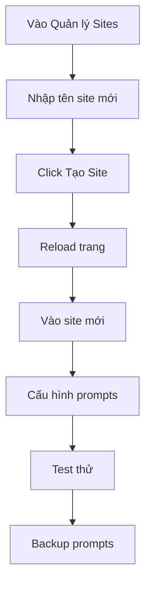

# 🏢 Hướng dẫn Quản lý Sites

## 📋 Tổng quan

Page **"Quản lý Sites"** là trang quản lý trung tâm cho tất cả các site trong hệ thống. Thay thế cho `site_selector.py`, page mới này cung cấp giao diện đầy đủ để:

- ✅ Xem danh sách tất cả các sites
- ✅ Tạo site mới từ template
- ✅ Xóa site và dữ liệu liên quan
- ✅ Xem chi tiết và thống kê từng site

## 🚀 Truy cập

Sau khi khởi động ứng dụng Streamlit:

```
http://localhost:8501
```

Chọn **"Quản lý Sites"** từ sidebar bên trái.

## 📊 Giao diện chính

### 1. Danh sách Sites

Hiển thị bảng tất cả sites với thông tin:

| Site | 📝 Prompts | 📦 Backup | 📊 Test Results | ⏰ Scheduled |
|------|-----------|----------|----------------|-------------|
| Agent HR Nội bộ | ✅ | ✅ | 15 files | ❌ |
| THFC | ✅ | ✅ | 8 files | ✅ |

**Ý nghĩa các cột:**
- **📝 Prompts**: Site đã có prompts cấu hình
- **📦 Backup**: Site đã có backup
- **📊 Test Results**: Số lượng file kết quả test
- **⏰ Scheduled**: Site có scheduled job không

### 2. Tạo Site Mới

**Input:**
- Tên site (ví dụ: "Customer Support", "Sales Team")

**Quy trình:**

```
1. Nhập tên site → 2. Click "🎯 Tạo Site" → 3. Reload trang → 4. Site mới xuất hiện
```

**Điều gì xảy ra khi tạo site mới:**

1. **Copy template**: 
   - File `original_site.py` được copy sang `pages/{Site Name}.py`
   - Biến `SITE` được tự động thay thế

2. **Tự động khởi tạo (khi truy cập site lần đầu)**:
   - Copy prompts từ `original_prompts/` → `prompts/{Site Name}/`
   - Copy extract_sections từ `original_prompts/` → `utils/{Site Name}/`
   - Tạo các thư mục cần thiết

3. **Sẵn sàng sử dụng**:
   - Site mới xuất hiện trong sidebar
   - Đầy đủ chức năng như các site khác
   - Có thể chỉnh sửa prompts ngay

### 3. Xóa Site

**Cảnh báo**: Hành động này xóa toàn bộ dữ liệu, **KHÔNG THỂ HOÀN TÁC**!

**Quy trình:**

```
1. Chọn site từ dropdown
2. Xem danh sách dữ liệu sẽ bị xóa
3. Tick "Xác nhận xóa"
4. Click "❌ Xóa Site"
```

**Dữ liệu bị xóa:**
- ✅ Page file (`pages/{Site}.py`)
- ✅ Prompts (`prompts/{Site}/`)
- ✅ Backup (`backup_prompts/{Site}/`)
- ✅ Utils/Extract sections (`utils/{Site}/`)
- ✅ Test results (`test_results/{Site}/`)
- ✅ Scheduled tests (`scheduled_tests/{Site}/`)

**Lưu ý:**
- Nên backup dữ liệu quan trọng trước khi xóa
- Nếu site có scheduled job, xóa job trước
- Reload trang sau khi xóa

### 4. Chi tiết Site

Chọn một site để xem thông tin chi tiết:

**Metrics hiển thị:**
- 📝 **Prompts**: Có/Không + số lượng files
- 📦 **Backup**: Có/Không + số lượng files  
- 📊 **Test Results**: Số lượng file kết quả
- ⏰ **Scheduled**: Có/Không scheduled job

**Đường dẫn files:**
- Hiển thị đầy đủ path của tất cả thư mục/file
- Đánh dấu ✅/❌ cho các path tồn tại/không tồn tại

## 🎯 Use Cases

### Use Case 1: Tạo site mới cho team khác

**Tình huống**: Team Sales muốn có site riêng

**Các bước:**

1. Vào page "Quản lý Sites"
2. Nhập tên: "Sales Team"
3. Click "🎯 Tạo Site"
4. Reload trang (Ctrl+R)
5. Chọn "Sales Team" từ sidebar
6. Vào tab "Quản lý Prompts" để cấu hình

**Kết quả:**
- Site "Sales Team" có đầy đủ chức năng
- Prompts mặc định từ template
- Có thể bắt đầu test ngay

### Use Case 2: Dọn dẹp site cũ không dùng

**Tình huống**: Site "Test Demo" không còn sử dụng

**Các bước:**

1. Vào page "Quản lý Sites"
2. Scroll xuống section "🗑️ Xóa Site"
3. Chọn "Test Demo" từ dropdown
4. Xem danh sách dữ liệu sẽ xóa
5. Backup nếu cần (copy thư mục `backup_prompts/Test Demo/`)
6. Tick "Xác nhận xóa"
7. Click "❌ Xóa Site"
8. Reload trang

**Kết quả:**
- Site "Test Demo" biến mất khỏi sidebar
- Toàn bộ dữ liệu đã bị xóa
- Hệ thống gọn gàng hơn

### Use Case 3: Kiểm tra trạng thái tất cả sites

**Tình huống**: Muốn biết site nào chưa có backup

**Các bước:**

1. Vào page "Quản lý Sites"
2. Xem bảng danh sách sites
3. Cột "📦 Backup" cho biết site nào có backup
4. Click vào từng site để xem chi tiết

**Kết quả:**
- Biết được sites nào cần backup
- Có thể vào từng site để backup

## 📁 Cấu trúc Site

Mỗi site được quản lý theo cấu trúc sau:

```
VPCP_AutoTest/
├── pages/
│   ├── Agent HR Nội bộ.py         ← Page chính
│   ├── THFC.py
│   └── Quản lý Sites.py            ← Page quản lý (MỚI)
│
├── original_prompts/               ← Template cho site mới
│   ├── system_prompt.txt
│   ├── human_prompt.txt
│   └── extract_sections.py
│
├── prompts/                        ← Prompts của từng site
│   ├── Agent HR Nội bộ/
│   │   ├── system_prompt.txt
│   │   └── human_prompt.txt
│   └── THFC/
│       ├── system_prompt.txt
│       └── human_prompt.txt
│
├── backup_prompts/                 ← Backup của từng site
│   ├── Agent HR Nội bộ/
│   │   ├── system_prompt.txt
│   │   ├── human_prompt.txt
│   │   └── extract_sections.py
│   └── THFC/
│       └── ...
│
├── utils/                          ← Extract code của từng site
│   ├── Agent HR Nội bộ/
│   │   └── extract_sections.py
│   └── THFC/
│       └── extract_sections.py
│
├── test_results/                   ← Kết quả test
│   ├── Agent HR Nội bộ/
│   │   ├── test_*.xlsx
│   │   ├── failed_tests.pkl
│   │   └── test_history.pkl
│   └── THFC/
│       └── ...
│
└── scheduled_tests/                ← Scheduled test files
    ├── Agent HR Nội bộ/
    │   └── *.xlsx
    └── THFC/
        └── ...
```

## 🔄 Workflow Khuyến nghị

### Workflow 1: Tạo site mới



### Workflow 2: Backup toàn bộ sites

```
1. Vào từng site
2. Tab "Quản lý Prompts"
3. Click "📦 Backup"
4. Lặp lại cho tất cả sites
```

### Workflow 3: Migration site cũ

```
1. Export dữ liệu từ site cũ
2. Tạo site mới với tên khác
3. Import prompts vào site mới
4. Test kỹ site mới
5. Xóa site cũ
```

## ⚠️ Lưu ý quan trọng

### 1. Về tên site

- ✅ **Nên**: Dùng tên có ý nghĩa, dễ nhớ
- ✅ **Nên**: Dùng tiếng Việt có dấu (hỗ trợ Unicode)
- ❌ **Không nên**: Dùng ký tự đặc biệt như `/`, `\`, `*`
- ❌ **Không nên**: Tạo site trùng tên

### 2. Về xóa site

- ⚠️ **KHÔNG THỂ HOÀN TÁC** - Hãy cẩn thận!
- 💡 Backup dữ liệu quan trọng trước
- 🔍 Kiểm tra kỹ site đang xóa
- ⏰ Xóa scheduled job trước (nếu có)

### 3. Về backup

- 💡 Backup thường xuyên trước khi chỉnh sửa
- 📦 Mỗi site có backup riêng
- 🔄 Backup mới ghi đè lên backup cũ
- ☁️ Nên backup thư mục `backup_prompts/` ra ngoài

### 4. Về prompts

- 📝 Site mới tự động copy từ `original_prompts/`
- 🔧 Có thể chỉnh sửa prompts sau khi tạo
- 💾 Nhớ lưu sau khi chỉnh sửa
- 🔄 Có thể reset về original hoặc backup

## 🐛 Troubleshooting

### Vấn đề 1: Site mới không xuất hiện

**Triệu chứng**: Sau khi tạo site, không thấy trong sidebar

**Giải pháp**:
```bash
# Reload trang
Ctrl+R (Windows/Linux) hoặc Cmd+R (Mac)

# Hoặc restart Streamlit
Ctrl+C
streamlit run site_selector.py
```

### Vấn đề 2: Lỗi khi tạo site

**Triệu chứng**: "Site đã tồn tại!" hoặc lỗi permission

**Giải pháp**:
```bash
# Kiểm tra site đã tồn tại chưa
ls pages/

# Kiểm tra permissions
ls -la pages/
chmod 755 pages/

# Kiểm tra original_site.py
ls -la original_site.py
```

### Vấn đề 3: Không xóa được site

**Triệu chứng**: Lỗi permission denied khi xóa

**Giải pháp**:
```bash
# Đóng tất cả tab của site đó trong browser
# Đảm bảo không có process nào đang dùng file

# Nếu vẫn lỗi, xóa thủ công
rm -rf "pages/{Site Name}.py"
rm -rf "prompts/{Site Name}/"
rm -rf "backup_prompts/{Site Name}/"
# ...
```

### Vấn đề 4: Prompts không load

**Triệu chứng**: Site mới không có prompts

**Giải pháp**:
```bash
# Kiểm tra original_prompts
ls -la original_prompts/

# Nếu thiếu, tạo lại
mkdir -p original_prompts
touch original_prompts/system_prompt.txt
touch original_prompts/human_prompt.txt
```

## 📊 Best Practices

### 1. Đặt tên site

```
✅ Good:
- "Customer Support"
- "Sales Team"
- "HR Internal"
- "THFC"

❌ Bad:
- "test123"
- "site_new_final_v2"
- "aaa"
```

### 2. Quản lý site

```
📅 Hàng tuần:
- Backup toàn bộ sites
- Kiểm tra test results
- Xóa sites không dùng

📆 Hàng tháng:
- Dọn dẹp test results cũ
- Archive backup cũ
- Review cấu hình prompts
```

### 3. Backup strategy

```
Cấp 1: Backup trong ứng dụng (nút 📦 Backup)
  → Lưu tại backup_prompts/
  → Tự động ghi đè

Cấp 2: Backup thư mục backup_prompts/
  → Copy ra ngoài project
  → Định kỳ hàng tuần

Cấp 3: Git commit
  → Commit cả prompts/ và backup_prompts/
  → Push lên remote
```

## 🎓 Ví dụ thực tế

### Tạo site mới cho team Marketing

```python
# Bước 1: Vào "Quản lý Sites"
# Bước 2: Nhập tên: "Marketing Team"
# Bước 3: Click "🎯 Tạo Site"

# → File được tạo: pages/Marketing Team.py
# → Nội dung giống original_site.py, chỉ khác SITE = "Marketing Team"

# Bước 4: Reload trang → Thấy "Marketing Team" trong sidebar
# Bước 5: Click vào "Marketing Team"
# Bước 6: Vào tab "Quản lý Prompts"

# → Prompts tự động copy từ original_prompts/
# → Có thể chỉnh sửa theo nhu cầu Marketing

# Bước 7: Chỉnh sửa System Prompt cho Marketing
# Bước 8: Click "💾 Lưu"

# → Extract sections tự động tạo
# → Site sẵn sàng cho test
```

## 📚 Tham khảo

- [backup_prompts/README.md](./backup_prompts/README.md) - Chi tiết về backup
- [original_prompts/README.md](./original_prompts/README.md) - Chi tiết về original prompts
- [DOCKER_UPDATE_GUIDE.md](./DOCKER_UPDATE_GUIDE.md) - Hướng dẫn Docker

---

**Chúc bạn quản lý sites hiệu quả! 🚀**

